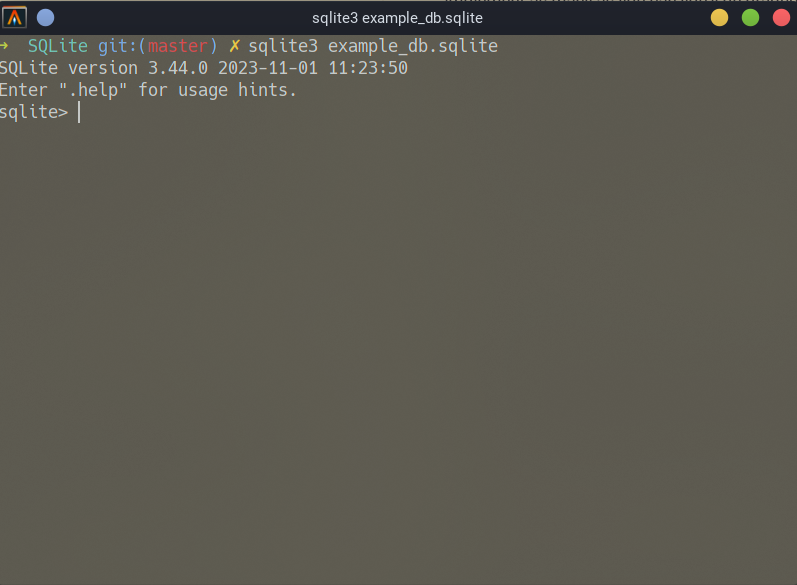
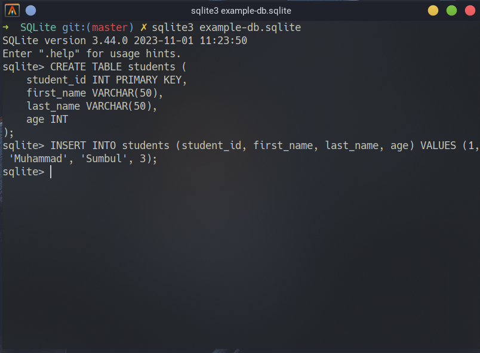
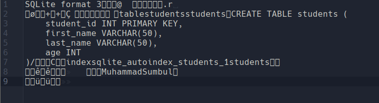

# SQLite:
To get comfortable, I would suggest you to install SQLite on your system first. SQLite is just an SQL db that operates on a single file. So, you can have a single file called `my_db.sqlite` and you're free to use that as your SQL Database instead of creating an SQL server and then having user credentials to access databases. A `*.sqlite` is enough and fully contains the database.

Let's start by looking at how SQLite stores data.
In this repo, you can find a file `./SQLite/example_db.sqlite`. I will be adding something data to it now.

Here, I have opened the file which is also our db, from SQLite CLI tool. You will need to make a similar CLI tool too to interact with your DB. You can use any language to build it.


Now let us first create a table in our database.
```sql
CREATE TABLE students (
    student_id INT PRIMARY KEY,
    first_name VARCHAR(50),
    last_name VARCHAR(50),
    age INT
);
```
Now, let us insert a student into our newly created table:
```sql
INSERT INTO students (student_id, first_name, last_name, age) VALUES (1, 'Muhammad', 'Sumbul', 3);
```

Here's what my terminal looks like after this:


If we now open the `example-db.sqlite` from a text editor, we will see something like this:


This is a binary file. You might see characters in this and think that this is a text file but this is because the text editor tries to interpret each byte as a character.


## File Format
### Database Header:
Section 1.3 of the SQLite file format documentation found [here](https://www.sqlite.org/fileformat2.html) reads:
> The first 100 bytes of the database file comprise the database file header. The database file header is divided into fields as shown by the table below. All multibyte fields in the database file header are stored with the most significant byte first (big-endian).

Which follows a table that gives the offset and the size in bytes of different fields of information of the header. Each entry of the header table is also explained in that same page.

#### Endianness:
Note that these bytes are stored in the big-endian format. You should read about endianness [here](https://www.geeksforgeeks.org/little-and-big-endian-mystery/).

To determine whether your system uses big endian or little endian by default, you can use this simple `C++` program.

```cpp
#include <iostream>
#include <cstdint>
using namespace std;

bool is_big_endian()
{
    union {
        uint32_t i;
        char c[4];
    } bint = {0x01020304};

    return bint.c[0] == 1;
}


int main() {
    cout << (is_big_endian()? "Big Endian": "Little Endian");
}
```

However, it would most likely be in little endian by default which means you'll have to make a conversion function which would simply reverse the bytes of the given integer of any size. You're advised to use standard integer types such as `int32_t`, `int16_t`, `int64_t` or `uint32_t` for an unsigned 32-bit (4-byte) integer instead of the platform/architecture dependent `int` or `short` or `long long`.
